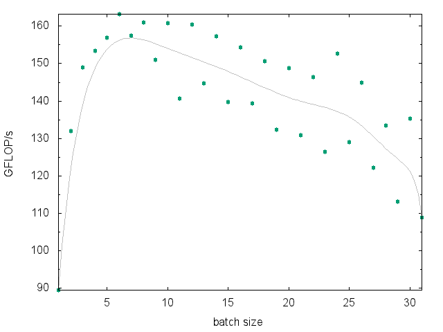
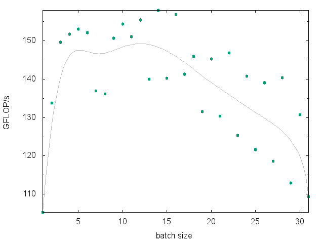

LIBXSTREAM
==========
Library to work with streams, events, and code regions that are able to run asynchronous while preserving the usual stream conditions. The library is targeting Intel Architecture (x86) and helps to offload work to an Intel Xeon Phi coprocessor (an instance of the Intel Many Integrated Core "MIC" Architecture). For example, using two streams may be an alternative to the usual double-buffering approach which can be used to hide buffer transfer time behind compute. [[pdf]](https://github.com/hfp/libxstream/raw/master/documentation/libxstream.pdf) [[src]](https://github.com/hfp/libxstream/archive/master.zip)

Interface
=========
The library's application programming interface (API) completely seals the implementation and only forward-declares types which are beyond the language's built-in types. The entire API consists of the **Data Types**, the **Device Interface**, the **Memory Interface**, the **Stream Interface**, the **Event Interface**, the **Function Interface**, and the **Query Interface**. All of these interfaces are briefly introduced and presented using a code snippet (below). The function interface for instance enables an own function to be enqueued for execution within a stream (via function pointer). A future release of the library will provide a native FORTRAN interface. [[c]](include/libxstream.h) [f90]

**Data Types**: are forward-declared types used in the interface.

```C
/** Boolean state. */
typedef int libxstream_bool;
/** Stream type. */
typedef struct libxstream_stream libxstream_stream;
/** Event type. */
typedef struct libxstream_event libxstream_event;
/** Function argument type. */
typedef struct libxstream_argument libxstream_argument;
/** Function type of an offloadable function. */
typedef void (*libxstream_function)(LIBXSTREAM_VARIADIC);
```

**Device Interface**: provides the notion of an "active device" (beside of allowing to query the number of available devices). Multiple active devices can be specified on a per host-thread basis. None of the other functions of the API implies an active device. It is up to the user to make use of this notion.

```C
size_t ndevices = 0;
libxstream_get_ndevices(&ndevices);
```

**Memory Interface**: is mainly for handling device-side buffers (allocation, copy). It is usually beneficial to allocate host memory using these functions as well. However, any memory allocation on the host is interoperable. It is also supported copying parts to/from a buffer.

```C
const int dev = 0;
libxstream_mem_allocate(-1,  &input, sizeof(double) * nitems, 0/*automatic alignment*/);
libxstream_mem_allocate(-1, &output, sizeof(double) * nitems, 0/*automatic alignment*/);
// TODO: initialize with some input data
libxstream_mem_allocate(dev,  &idev, sizeof(double) * nbatch, 0/*automatic alignment*/);
libxstream_mem_allocate(dev,  &odev, sizeof(double) * nbatch, 0/*automatic alignment*/);

for (int i = 0; i < nitems; i += nbatch) {
  const int ibatch = sizeof(double) * min(nbatch, nitems - i)
  libxstream_memcpy_h2d(input + i, idev, ibatch, stream[i%2]);
  // TODO: invoke user function
  libxstream_memcpy_d2h(odev, output + i, ibatch, stream[i%2]);
}

libxstream_mem_deallocate(-1, input);
libxstream_mem_deallocate(-1, output);
libxstream_mem_deallocate(dev, idev);
libxstream_mem_deallocate(dev, odev);
```

**Stream Interface**: is used to expose the available parallelism. A stream preserves the predecessor/successor relationship while participating in a pipeline (parallel pattern) in case of multiple streams. Synchronization points can be introduced using the stream interface as well as the event interface.

```C
libxstream_stream* stream[2];
libxstream_stream_create(stream + 0, d, 1/*demux*/, 0/*priority*/, "s1");
libxstream_stream_create(stream + 1, d, 1/*demux*/, 0/*priority*/, "s2");
// TODO: do something with the streams
libxstream_stream_sync(0); // wait for all streams
libxstream_stream_destroy(stream[0]);
libxstream_stream_destroy(stream[1]);
```

**Event Interface**: provides a more sophisticated mechanism allowing to wait for a specific work item to complete without the need to also wait for the completion of work queued after the item in question.

```C
libxstream_event* event[2/*N*/];
libxstream_event_create(event + 0);
libxstream_event_create(event + 1);

for (int i = 0; i < nitems; i += nbatch) {
  const size_t j = i % N;
  // TODO: copy-in, user function, copy-out
  libxstream_event_record(event + j, stream + j);

  // synchronize every Nth iteration
  if (j == (N - 1)) {
    for (size_t k = 0; k < N; ++k) {
      libxstream_event_synchronize(event[k]);
    }
  }
}

libxstream_event_destroy(event[0]);
libxstream_event_destroy(event[1]);
```

**Function Interface**: is used to describe and call an user function along with its list of arguments. The function's signature consists of inputs, outputs, or in-out arguments. An own function can be enqueued for execution within a stream by taking the address of the function.

```C
size_t nargs = 4, arity = 0;
libxstream_argument* signature;
libxstream_fn_create_signature(&signature, nargs/*maximum number of arguments*/);
libxstream_fn_input (signature, 0/*1st*/, input, libxstream_type2value<double>::value, 1, &nbatch);
libxstream_fn_output(signature, 1/*2nd*/, output, LIBXSTREAM_TYPE_F64/*no C++ svp.*/,  1, &nbatch);
libxstream_fn_nargs(signature, &nargs); // 4
libxstream_fn_arity(signature, &arity); // 2
libxstream_fn_call((libxstream_function)function, signature, stream, LIBXSTREAM_CALL_DEFAULT);
libxstream_fn_destroy_signature(signature);
```

**Query Interface**: allows to query information about function arguments when inside of an user function that is called by the library. This can be used to introspect the function arguments in terms of type, dimensionality, shape, and other properties.

```C
LIBXSTREAM_TARGET(mic) void function(const double* input, double* output)
{
  const libxstream_argument* iarg = 0;
  libxstream_get_argument(input, &iarg);

  size_t size = 0;
  libxstream_get_shape(iarg, &size);

  libxstream_type type = LIBXSTREAM_TYPE_VOID;
  libxstream_get_type(iarg, &type);

  const char* name = 0;
  libxstream_get_typename(type, &name);
  printf("type=%s", name); // f32
}
```

Implementation
==============
The library's implementation allows queuing work from multiple host threads in a thread-safe manner and without oversubscribing the device. The actual implementation vehicle can be configured using a [configuration header](include/libxstream_config.h). Currently Intel's Language Extensions for Offload (LEO) are used to perform asynchronous execution and data transfers using signal/wait clauses. Other mechanisms can be implemented e.g., hStreams or COI (both are part of the Intel Manycore Platform Software Stack), or offload directives as specified by OpenMP.

The current implementation is falling back to host execution in cases where no coprocessor is present, or when the executable was not built using the Intel Compiler. However, there is no attempt (yet) to exploit the parallelism available on the host system.

Performance
===========
The [multi-dgemm](samples/multi-dgemm) sample code is the implementation of a benchmark (beside of illustrating the use of the library). The shown performance is not meant to be "the best case". Instead, the performance is reproduced by a program constructing a series of matrix-matrix multiplications of varying problem sizes with no attempt to avoid the implied performance penalties (see underneath the graph for more details). A reasonable host system and benchmark implementation is likely able to outperform below results (no transfers, etc.).


> This performance graph has been created for a single Intel Xeon Phi 7120 Coprocessor card by running "OFFLOAD_DEVICES=0 ./[benchmark.sh](samples/multi-dgemm/benchmark.sh) 250 1 2 1" on the host system. The script varies the number of matrix-matrix multiplications queued at once. The program is rather a stress-test than a benchmark since there is no attempt to avoid the performance penalties as mentioned below. The plot shows ~150 GFLOPS/s even with smaller batch sizes.

Even the series of matrices with the largest problem size of the mix is not close to being able to reach the peak performance, and there is an insufficient amount of FLOPS available to hide the cost of transferring the data. The data needed for the computation moreover includes a set of indices describing the offsets of each of the matrix operands in the associated buffers. The latter implies unaligned memory accesses due to packing the matrix data without a favorable leading dimension. Transfers are performed as needed on a per-computation basis rather than aggregating a single copy-in and copy-out prior and past of the benchmark cycle. Moreover, there is no attempt to balance the mixture of different problem sizes when queuing the work into the streams.

Tuning
======
The library supports a manual locking approach which can be requested at runtime on a per-stream basis instead of an automatic internal locking ("demux" mode). Manual locking also allows queuing work without the need for intermediate stream synchronization in case the effect of the work is not needed at this point in time. The locking approach effectively describes a logical group of work. In contrast, the automatic locking attempts to derive this information at the points where the stream synchronization function is called.


> The above plot illustrates the impact of manual locking in contrast to the "demux" mode of operation. Results have been gathered by running "OFFLOAD_DEVICES=0 ./[benchmark.sh](samples/multi-dgemm/benchmark.sh) 250 1 2 0" with otherwise the same conditions as mentioned in the [Performance](#performance) section. The plot shows ~155 GFLOPS/s and therefore a minor impact of manual locking.

Please note that the manual locking approach does not contradict the thread-safety claimed by the library; each queuing operation is still atomic. Synchronization and locking in general avoids intermixing work from different logical groups of work. An example where this becomes a problem (data races) is when the work is buffered only for a subset (work group) of the total amount of work, and when multiple host threads are queuing work items into the same stream at the same time.
