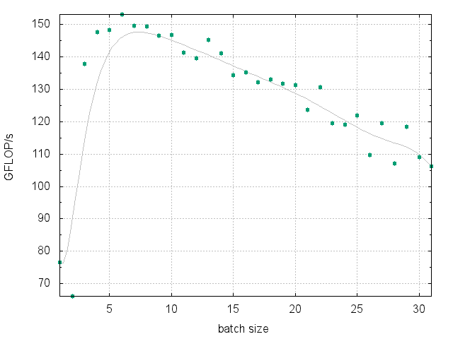
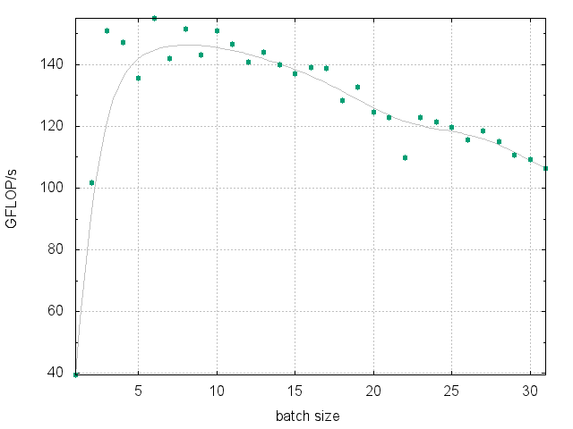

# LIBXSTREAM
Library to work with streams, events, and code regions that are able to run asynchronous while preserving the usual stream conditions. The library is targeting Intel Architecture (x86) and helps to offload work to an Intel Xeon Phi coprocessor (an instance of the Intel Many Integrated Core "MIC" Architecture). For example, using two streams may be an alternative to the usual double-buffering approach which can be used to hide buffer transfer time behind compute. [[pdf](https://github.com/hfp/libxstream/raw/master/documentation/libxstream.pdf)] [[src](https://github.com/hfp/libxstream/archive/master.zip)]

## Interface
The library's application programming interface (API) completely seals the implementation and only forward-declares types which are beyond the language's built-in types. The entire API consists of the **Data Types**, the **Device Interface**, the **Memory Interface**, the **Stream Interface**, the **Event Interface**, the **Function Interface**, and the **Query Interface**. All of these interfaces are briefly introduced and presented using a code snippet (below). The function interface for instance enables an own function to be enqueued for execution within a stream (via function pointer). A future release of the library will provide a native FORTRAN interface. [[c](include/libxstream.h)] [f90]

### Data Types
Data types are forward-declared types used in the interface.

```C
/** Boolean state. */
typedef int libxstream_bool;
/** Stream type. */
typedef struct libxstream_stream libxstream_stream;
/** Event type. */
typedef struct libxstream_event libxstream_event;
/** Function argument type. */
typedef struct libxstream_argument libxstream_argument;
/** Function type of an offloadable function. */
typedef void (*libxstream_function)(LIBXSTREAM_VARIADIC);
```

### Device Interface
The device interface provides the notion of an "active device" (beside of allowing to query the number of available devices). Multiple active devices can be specified on a per host-thread basis. None of the other functions of the API implies an active device. It is up to the user to make use of this notion.

```C
size_t ndevices = 0;
libxstream_get_ndevices(&ndevices);
```

### Memory Interface
The memory interface is mainly for handling device-side buffers (allocation, copy). It is usually beneficial to allocate host memory using these functions as well. However, any memory allocation on the host is interoperable. It is also supported copying parts to/from a buffer.

```C
const int dev = 0;
libxstream_mem_allocate(-1,  &input, sizeof(double) * nitems, 0/*auto-alignment*/);
libxstream_mem_allocate(-1, &output, sizeof(double) * nitems, 0/*auto-alignment*/);
// TODO: initialize with some input data
libxstream_mem_allocate(dev,  &idev, sizeof(double) * nbatch, 0/*auto-alignment*/);
libxstream_mem_allocate(dev,  &odev, sizeof(double) * nbatch, 0/*auto-alignment*/);

for (int i = 0; i < nitems; i += nbatch) {
  const int ibatch = sizeof(double) * min(nbatch, nitems - i), j = i / nbatch;
  libxstream_memcpy_h2d(input + i, idev, ibatch, stream[j%2]);
  // TODO: invoke user function
  libxstream_memcpy_d2h(odev, output + i, ibatch, stream[j%2]);
}

libxstream_mem_deallocate(-1, input);
libxstream_mem_deallocate(-1, output);
libxstream_mem_deallocate(dev, idev);
libxstream_mem_deallocate(dev, odev);
```

### Stream Interface
The stream interface is used to expose the available parallelism. A stream preserves the predecessor/successor relationship while participating in a pipeline (parallel pattern) in case of multiple streams. Synchronization points can be introduced using the stream interface as well as the event interface.

```C
libxstream_stream* stream[2];
libxstream_stream_create(stream + 0, d, 1/*demux*/, 0/*priority*/, "s1");
libxstream_stream_create(stream + 1, d, 1/*demux*/, 0/*priority*/, "s2");
// TODO: do something with the streams
libxstream_stream_sync(0); // wait for all streams
libxstream_stream_destroy(stream[0]);
libxstream_stream_destroy(stream[1]);
```

### Event Interface
The event interface provides a more sophisticated mechanism allowing to wait for a specific work item to complete without the need to also wait for the completion of work queued after the item in question.

```C
libxstream_event* event[2/*N*/];
libxstream_event_create(event + 0);
libxstream_event_create(event + 1);

for (int i = 0; i < nitems; i += nbatch) {
  const size_t j = i / nbatch, n = j % N;
  // TODO: copy-in, user function, copy-out
  libxstream_event_record(event + n, stream + n);

  // synchronize every Nth iteration
  if (n == (N - 1)) {
    for (size_t k = 0; k < N; ++k) {
      libxstream_event_synchronize(event[k]);
    }
  }
}

libxstream_event_destroy(event[0]);
libxstream_event_destroy(event[1]);
```

### Function Interface
The function interface is used to describe and call a user function along with its list of arguments. The function's signature consists of inputs, outputs, or in-out arguments. An own function can be enqueued for execution within a stream by taking the address of the function.

```C
size_t nargs = 5, arity = 0;
libxstream_argument* args = 0;
libxstream_fn_create_signature(&args, nargs/*maximum number of arguments*/);
libxstream_fn_nargs (args, &nargs); // 5 (maximum number of arguments)
libxstream_fn_arity (args, &arity); // 0 (no arguments constructed yet)
libxstream_fn_call((libxstream_function)f, args, stream, LIBXSTREAM_CALL_DEFAULT);
libxstream_fn_destroy_signature(args); // (can be used for many function calls)
```

#### Example: void f(double scale, const float* in, float* out, size_t n, size_t* nzeros)
A first observation is that a function's return type cannot be specified. Any results need to go over the argument list (which also allows multiple results to be delivered). To pass arguments, two mechanisms are supported: by-value and by-pointer. The latter is called "by-pointer" (or by-address) to distinct from the C++ reference type mechanism (which is not allowed).

```C
const libxstream_type sizetype = libxstream_type2value<size_t>::value;
libxstream_fn_input (args, 0, &scale, LIBXSTREAM_TYPE_F64, 0, 0);
libxstream_fn_input (args, 1, in, LIBXSTREAM_TYPE_F32, 1, &n);
libxstream_fn_output(args, 2, out, LIBXSTREAM_TYPE_F32, 1, &n);
libxstream_fn_input (args, 3, &n, sizetype, 0, 0);
libxstream_fn_output(args, 4, &nzeros, sizetype, 0, 0);
```

#### Example: weak type information
To construct a signature with only weak type information, (1) no distinction between inout and output arguments need to be made, and (2) LIBXSTREAM_TYPE_BYTE as an elemental type. Of course, the latter implies that all extents are counted in Byte rather than the number of elements.

```C
const size_t typesize = sizeof(float);
// argument type: const unsigned char*
libxstream_fn_input(args, 0,  &f1, LIBXSTREAM_TYPE_BYTE, 1, &typesize);
// argument type: unsigned char*
libxstream_fn_inout(args, 1, data, LIBXSTREAM_TYPE_BYTE, 1, &numbytes);
```

### Query Interface
This "device-side" API allows to query information about function arguments when inside of a user function which is called by the library. This can be used to introspect the function's arguments in terms of type, dimensionality, shape, and other properties. In order to query a property, a handle for any pointer variable can be received (and reused for multiple queries). The query interface cannot be used for an argument which is given by value.

```C
LIBXSTREAM_TARGET(mic) void f(double scale, const float* in, float* out, size_t* nzeros)
{
  const libxstream_argument* ina = 0;
  libxstream_get_argument(in, &ina);

  size_t n = 0;
  libxstream_get_shape(ina, &n);

  libxstream_type type = LIBXSTREAM_TYPE_VOID;
  libxstream_get_type(ina, &type);

  const char* name = 0;
  libxstream_get_typename(type, &name);
  printf("type=%s", name); // f32
}
```

As one can see in the above example, the signature of a function can often be trimmed to omit arguments which certainly describe the shape of an argument (above function signature omits the "n" argument shown in one of the previous examples).

## Performance
The [multi-dgemm](samples/multi-dgemm) sample code is the implementation of a benchmark (beside of illustrating the use of the library). The shown performance is not meant to be "the best case". Instead, the performance is reproduced by a program constructing a series of matrix-matrix multiplications of varying problem sizes with no attempt to avoid the implied performance penalties (see underneath the graph for more details). A reasonable host system and benchmark implementation is likely able to outperform below results (no transfers, etc.).


> This performance graph has been created for a single Intel Xeon Phi 7120 Coprocessor card by running "OFFLOAD_DEVICES=0 ./[benchmark.sh](samples/multi-dgemm/benchmark.sh) 250 1 2 1" on the host system. The script varies the number of matrix-matrix multiplications queued at once. The program is rather a stress-test than a benchmark since there is no attempt to avoid the performance penalties as mentioned below. The plot shows ~145 GFLOPS/s even with smaller batch sizes.

Even the series of matrices with the largest problem size of the mix is not close to being able to reach the peak performance, and there is an insufficient amount of FLOPS available to hide the cost of transferring the data. The data needed for the computation moreover includes a set of indices describing the offsets of each of the matrix operands in the associated buffers. The latter implies unaligned memory accesses due to packing the matrix data without a favorable leading dimension. Transfers are performed as needed on a per-computation basis rather than aggregating a single copy-in and copy-out prior and past of the benchmark cycle. Moreover, there is no attempt to balance the mixture of different problem sizes when queuing the work into the streams.

## Tuning
### Synchronization
In cases where multiple host threads are enqueuing work into the same stream, a locking approach is needed in order to "demux" threads and streams. The locking approach effectively separates logical groups of work. The library supports three different approaches which can be requested at runtime on a per-stream basis:

 * Implicit locking when calling certain stream and event synchronization functions (demux=1).
 * Explicit locking by calling libxstream_stream_lock and libxstream_stream_unlock (demux=0).
 * [Heuristic locking](https://github.com/hfp/libxstream/raw/master/samples/multi-dgemm/plot-heuristic.png); automatically introduced (demux=-1).


> The above plot illustrates the impact of manual locking. Results have been gathered by running "OFFLOAD_DEVICES=0 ./[benchmark.sh](samples/multi-dgemm/benchmark.sh) 250 1 2 0" with otherwise the same conditions as mentioned in the [Performance](#performance) section. The plot shows ~145 GFLOPS/s and therefore a minor impact of manual locking.

Please note that the manual locking approach does not contradict the thread-safety claimed by the library; each queuing operation is still atomic. Synchronization and locking in general avoids intermixing work from different logical groups of work. An example where this becomes a problem (data races) is when the work is buffered only for a subset (work group) of the total amount of work, and when multiple host threads are queuing work items into the same stream at the same time.

### Hybrid Parallelism
Additional scalability can be unlocked when running an application which is parallelized using the Message Passing Interface (MPI). In this case, the device(s) can be partitioned according to the number of ranks per host processor. To read more about this, please visit the [MPIRUN WRAPPER](https://github.com/hfp/mpirun#mpirun-wrapper) project. To estimate the impact of this technique, one can scale the number of threads on the device until the performance saturates and then partition accordingly.

## Implementation
The library's implementation allows enqueuing work from multiple host threads in a thread-safe manner and without oversubscribing the device. The actual implementation vehicle can be configured using a [configuration header](include/libxstream_config.h). Currently Intel's Language Extensions for Offload (LEO) are used to perform asynchronous execution and data transfers using signal/wait clauses. Other mechanisms can be implemented e.g., hStreams or COI (both are part of the Intel Manycore Platform Software Stack), or offload directives as specified by OpenMP.

The current implementation is falling back to host execution in cases where no coprocessor is present, or when the executable was not built using the Intel Compiler. However, there is no attempt (yet) to exploit the parallelism available on the host system.
