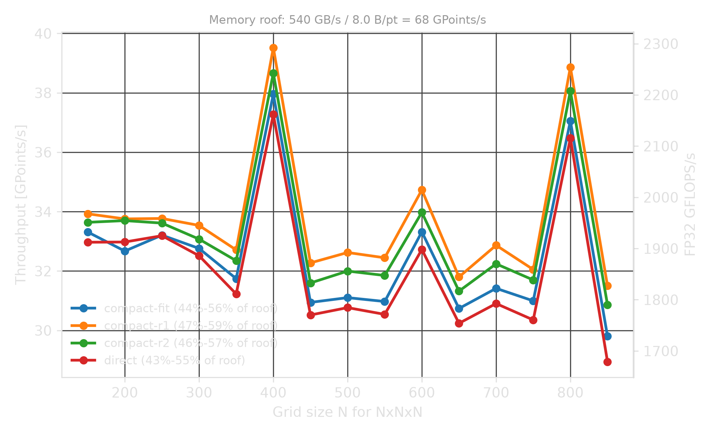
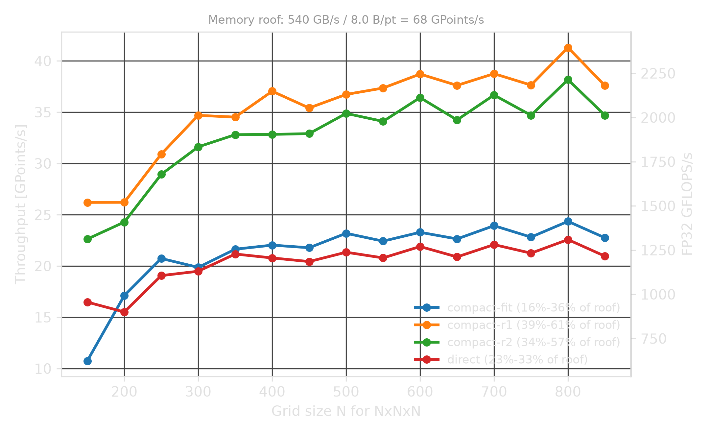
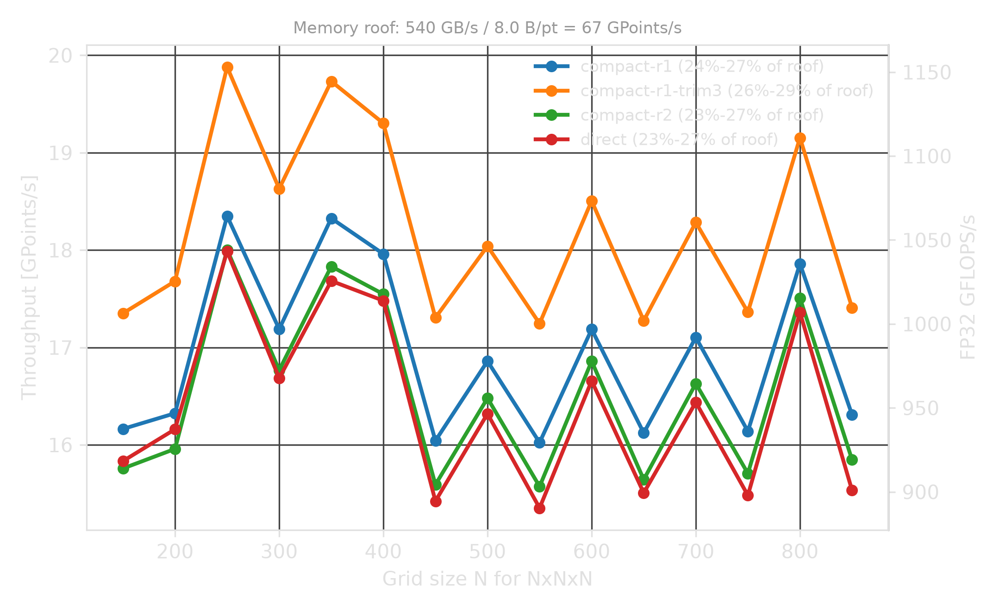
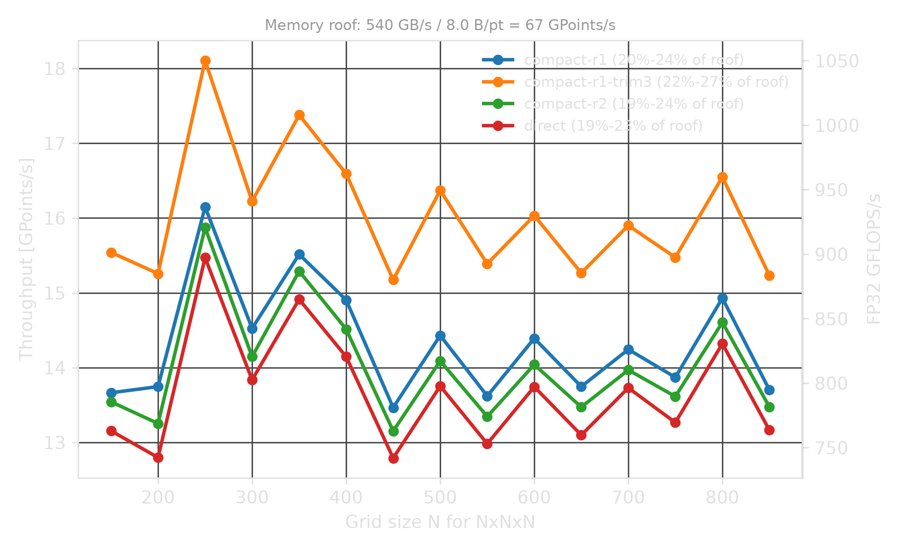

# Stencils as Small Matrix Multiplications

## How to leverage low-precision compute?

LIBXSTREAM stencil sample

---

## Abstract

<span style="font-size: 75%;">
High-order FD stencils for seismic wave propagation are bandwidth-bound on modern GPUs.
We reformulate the 3D isotropic Laplacian as three small dense matrix multiplications per axis,
mapping the banded Toeplitz operator to hardware matrix engines (Intel DPAS) that would otherwise sit idle.
To preserve FP32 accuracy from BF16 and INT8 datapaths, we apply Dekker splitting
(2 operator digits x 3 wavefield digits) and Ozaki-1 slicing
(1 operator digit x 1-3 adaptive wavefield digits with a carried-forward exponent).
No prior work combines Dekker/Ozaki digit splitting with hardware matrix engines
for finite-difference stencil operators.
</span>

---

## Outline

- Seismic stencils and their long spatial legs.
- Mapping stencil operators to small dense GEMMs.
- BF16 and INT8 DPAS preserving FP32 accuracy.
- Compact operators as alternative paths.
- Implementation and performance on Arc B580.

---

## Timeline

| Time      | Topic                                   |
|-----------|-----------------------------------------|
| 0-5 min   | Application: RTM and wave propagation   |
| 5-10 min  | Stencil math and long legs              |
| 10-18 min | Mapping stencils to GEMM/DPAS           |
| 18-24 min | INT8-DPAS Ozaki-1, BF16 vs INT8         |
| 24-30 min | Implementation, performance, discussion |

---

## Why Seismic Stencils?

Reverse Time Migration (RTM) and Full Waveform Inversion (FWI)  
solve wave equations over 3D grids.

$$p_{next} = 2 \cdot p_{now} - p_{prev} + \Delta t^2 \cdot v^2 \cdot \mathcal{L}(p_{now})$$

- $p$: pressure wavefield
- $v$: velocity model
- $\mathcal{L}$: spatial differential operator

The hot loop is repeated stencil evaluation over (many) grid points.

---

## Implemented in the Sample

The current sample is a GPU stencil benchmark and integration example.

| Mode                          | CLI              | Implemented path                              |
|-------------------------------|------------------|-----------------------------------------------|
| FP32 stencil (default)        |                  | SLM-tiled banded FMA, XYZ and ZYX layouts     |
| Isotropic RTM-style Laplacian | `-d 3`           | fused 3-axis DPAS apply                       |
| TTI-style anisotropic terms   | `-d 9`           | pure terms plus cross-derivative DPAS phases  |
| Direct high-order stencil     | `-m 0`           | radius-4 per axis                             |
| Compact variants              | `-m 1`, `-m 2`   | radius-1/radius-2 compact runtime paths       |
| Compact dispersion-fit        | `-m 3`           | minimax-fitted coefficients (PPW=8 default)   |
| BF16-DPAS Dekker split        | `STENCIL_BF16=1` | 2 operator x 3 wavefield BF16 digits          |
| BF16-DPAS scalar fallback     | `STENCIL_BF16=2` | same structure, float accumulation            |
| INT8-DPAS Ozaki-1 (Intel)     | `STENCIL_INT8=1` | signed 8-bit slicing with carried exponent    |
| INT8 dp4a Ozaki-1 (NV>=2)     | `STENCIL_INT8=1` | Ozaki-1 slicing, PTX dp4a on NVIDIA SM>=7.5   |
| INT8 scalar fallback          | `STENCIL_INT8=2` | Ozaki-1 slicing, scalar multiply-add          |

Note: LP kernels (BF16/INT8) require XYZ or blocked layout.
ZYX layout automatically falls back to the FP32 kernel.

---

## Block View

The sample updates one `32 x 32 x 32` output cube per block.

```text
BLK       = 32
RADIUS    = 4          direct 8th-order FD
K_BASE    = BLK + 2*RADIUS = 40
K_PAD     = align16(K_BASE) = 48  (BF16)
K_PAD_I8  = 64                    (INT8, k=32 DPAS alignment)
XMX tile  = 8 x 16
```

For one axis, each block becomes a matrix multiplication.

```text
BF16: D[32 x 48]  * P[48 x 1024]  -> Y[32 x 1024]
INT8: D[32 x 64]  * P[64 x 16]    -> Y[32 x 16]  (per strip)
```

---

## Direct Long-Leg Stencil

An 8th-order second derivative has a radius-4 stencil.

$$u''(i) \approx c_0 \cdot u(i) + \sum_{k=1}^{4} c_k \bigl[u(i-k) + u(i+k)\bigr]$$

Each output point reads nine positions along one axis.  
In 3D isotropic mode this is applied along $x$, $y$, and $z$.

---

## Long Legs as a Matrix

The 1D stencil is a banded operator matrix.

$$D = \begin{bmatrix}
c_4 & c_3 & c_2 & c_1 & c_0 & c_1 & c_2 & c_3 & c_4 & 0 & \cdots \\\\
0 & c_4 & c_3 & c_2 & c_1 & c_0 & c_1 & c_2 & c_3 & c_4 & \cdots \\\\
& & & & \ddots & & & & & &
\end{bmatrix}$$

$$Y = D \cdot P$$

The sample stores $D$ as a dense BF16 surface because DPAS wants regular tiles.  
The zeros are structural convenience.

---

## Three Isotropic GEMMs

The isotropic Laplacian separates into three 1D operators.

$$\mathcal{L}(p) = D_x \cdot p + D_y \cdot p + D_z \cdot p$$

For each axis, the kernel gathers a `K_PAD x XMX_N` panel into SLM
and applies the same DPAS micro-kernel.

```text
for dim in x, y, z:
    gather haloed lines into SLM
    split wavefield into BF16 digits
    accumulate D_dim * P_dim into FP32
```

---

## Low Precision Compute

Use matrix compute units but without giving up accuracy.

<span style="opacity: 0.4; font-size: 50%;">
[ConvStencil 2024] stencil-as-matmul on NVIDIA TC,
[Ichimura+ 2025] INT8 TC elastic wave FE</span>

This work represents FP32 values are as digit sums (Ozaki/Dekker):

$$D \cdot P \approx \sum_i \sum_j D_i \cdot P_j \qquad \text{each } D_i \cdot P_j \text{ is one DPAS call}$$

| Datatype | Digit width | D slices | P slices | Products/dim |
|----------|-------------|----------|----------|--------------|
| BF16     | 8 mantissa  | 2        | 3        | 6            |
| INT8     | 7 signed    | 1        | 1–3      | 1–3          |

Note: BF16 needs 2 D-slices because FD weights span ~11 mantissa bits.
INT8 needs only 1 D-slice because the same weights fit in 7 signed bits
after per-row exponent alignment.

---

## INT8 Ozaki-1

FD operator weights fit in a single 7-bit signed digit (NSLICES_D=1).
Only the wavefield (P-side) needs multi-slice representation.

$$D \cdot P \approx D_0 \sum_j P_j$$

Advantage: half the operator storage, fewer DPAS products.
The number of P slices adapts at runtime to the local exponent range.

```text
nslices_eff = 1  if assumed_exp <= 7
            = 2  if assumed_exp <= 14
            = 3  otherwise
```

---

## Carried-Forward Exponent

INT8 slicing needs a shared exponent per spatial strip.

```text
step N:   read exp_buf[old]  →  slice P  →  DPAS  →  write p_new
          scan p_new exponents  →  write exp_buf[new]

step N+1: read exp_buf[new]  →  ...         (buffers flip)
```

- Margin of +1: covers one-step neighbor growth propagation lag
- Output-based: tracks what was written, not what was read
- Double-buffered: no read/write race between neighbors

---

## DPAS Work Count

BF16 path: D-slices $\times$ P-slices $= 2 \times 3 = 6$ DPAS products per axis.  
INT8 path: $1 \times$ P-slices$_{eff}$ = 1–3 DPAS products per axis.

| Operator family   | BF16 work/block | INT8 work/block    |
|-------------------|-----------------|--------------------|
| Isotropic, direct | 3 axes x 6 = 18 | 3 axes x 1-3 = 3-9 |
| TTI pure terms    | 3 axes x 6 = 18 | (BF16 only today)  |
| TTI cross terms   | two DPAS phases | (BF16 only today)  |
| Compact           | smaller radius  | same DPAS, fewer K |

The shape is always small and regular: `8 x 16` DPAS tiles over the K dimension.

---

## Hardware Mapping

The kernel uses Intel GPU matrix and block I/O features.

```text
A-side: 8 rows x K_PAD    operator D (2D block read)
B-side: K_PAD x 16 cols   wavefield (SLM block read)
C:      8 x 16            FP32 accumulator
```

|      | A load         | B load          | DPAS         |
|------|----------------|-----------------|--------------|
| BF16 | 2D 16b 8r16x1c | VNNI from SLM   | bf16 mad k16 |
| INT8 | 2D 8b 8r32x1c  | block_read8 SLM | i8 mad k32   |

---

## TTI: Why It Is Different

Tilted Transverse Isotropy introduces mixed derivatives.

$$\mathcal{L}_\text{TTI}(p) = \text{pure terms} + \text{cross terms}$$

$$\text{cross term: } D_i\bigl(c_{ij} \cdot D_j \cdot p\bigr)$$

Not a wider 1D stencil — a composition of two directional  
derivatives with a pointwise anisotropy field in between.

---

## TTI as Two GEMM Phases

Each cross term is a two-phase DPAS pipeline:

$$T = D_j \cdot P \qquad T = c_{ij} \cdot T \qquad Y \mathrel{+}= D_i \cdot T$$

- `x_slm`: gathered wavefield digits
- `t_slm`: BF16 re-split intermediate after pointwise scaling
- Pure terms reuse the isotropic `stencil_apply` path

---

## Stencil Kinds and GEMM Shapes

| Stencil kind        | Math                            | GEMM form                             |
|---------------------|---------------------------------|---------------------------------------|
| 1D direct FD        | $D_i \cdot P$                   | $32 \times 48$ by $48 \times 1024$    |
| 3D isotropic        | $D_x P + D_y P + D_z P$         | three independent 1D GEMMs            |
| VTI-like pure terms | scaled pure axes                | three GEMMs plus coefficients         |
| TTI cross term      | $D_i(c_{ij} \cdot D_j \cdot P)$ | GEMM, scale, GEMM                     |
| Compact             | repeated compact evolution      | smaller-radius $D_r \cdot P$ per step |

The key design choice is to make the stencil look like many dense,  
small, predictable GEMMs.

---

## Long-Leg Motivation

High-order FD stencils use long spatial legs to reduce dispersion error.

| Benefit                          | Cost on large 3D grids       |
|----------------------------------|------------------------------|
| better wave propagation accuracy | wider block halos            |
| fewer time-step artifacts        | more distant memory accesses |
| familiar RTM/TTI formulation     | more L2/TLB pressure         |

Can time evolution provide the effective reach while each update  
touches only a compact neighborhood?
<span style="opacity: 0.3;">Yes, approximately.</span>

Note: Repeated compact updates compose into a wider domain of dependence.
The hard part is fitting the compact coefficients so the composed symbol
matches the long-leg stencil's dispersion behavior.

---

## Compact Operator Idea

Instead of applying the long-leg radius-4 operator directly,  
use compact operators over time.

<span style="opacity: 0.4; font-size: 50%;">
[Dablain 1986] cascaded Laplacians,
[Liu&Sen 2009] time-space optimized explicit,
[Zhang+ 2016] operator splitting for compact FD</span>

```text
direct:       one radius-4 operator

compact-r1:   radius-1 operator, K=4
compact-r2:   radius-2 operator, K=2
compact-fit:  radius-2/3 with dispersion-optimized coefficients
```

Compact-fit uses Golden Section Search by default to minimize  
the worst-case dispersion error over the band $[0, 2\pi/\text{PPW}]$.

Effective reach arises from repeated time updates,  
not from loading the long halo every step.

Note: PPW = Points Per Wavelength -- the number of grid points
that resolve one shortest wavelength of interest. Higher PPW
means the fitting band covers only well-resolved frequencies.

---

## What Is Implemented Today

| Method     | CLI              | Radius | Status                              |
|------------|------------------|--------|-------------------------------------|
| Direct     | `-m 0`           | `r=4`  | baseline high-order path (default)  |
| Compact r1 | `-m 1`           | `r=1`  | compact isotropic path              |
| Compact r2 | `-m 2`           | `r=2`  | compact isotropic path              |
| Compact fit| `-m 3`           | `r=2/3`| dispersion-fitted (minimax, PPW=8)  |
| TTI        | `-d 9`           | direct | cross terms implemented             |
| BF16       | `STENCIL_BF16=1` | all    | Dekker split, XYZ layout only       |
| INT8       | `STENCIL_INT8=1` | all    | Ozaki-1 with exp_buf, XYZ only      |

Environment variables `STENCIL_PPW`, `STENCIL_FIT`, `STENCIL_RADIUS_FIT`
control the target wavelength, fitting method, and fit radius.

---

## Kernel Structure

```text
host:  precompute D (BF16 or INT8+scale), JIT kernel

BF16:  gather → split → DPAS → leapfrog update
INT8:  gather+slice → DPAS → update → scan exp → exp_buf_out
TTI:   GEMM → scale → re-split → GEMM
```

All paths: one dispatch per time step, 3-dim loop inside kernel.

---

## Runtime Controls

Kernel path selection (default: FP32):

```text
STENCIL_BF16=1            BF16-DPAS Dekker path (Intel DPAS required)
STENCIL_BF16=2            BF16 structure, scalar fallback (any device)
STENCIL_INT8=1            INT8 Ozaki-1 (Intel DPAS or NVIDIA dp4a)
STENCIL_INT8=2            INT8 structure, scalar fallback (any device)
```

Tuning and accuracy controls:

```text
STENCIL_STRIPS_PER_WG=2   default, best measured grouping
STENCIL_TRIM=N            accuracy/performance tradeoff (BF16)
STENCIL_GRF256=1          tested slower on target system
STENCIL_LAYOUT=N          0=XYZ (default), 1=blocked, 2=ZYX
STENCIL_HALO=N            halo padding size per axis
STENCIL_PML=1             enable PML absorbing boundaries
STENCIL_PPW=8             points-per-wavelength for compact-fit
STENCIL_FIT=N             fit method: 0=L2, 1=Ricker, 2=minimax
STENCIL_RADIUS_FIT=N      fit radius (2 or 3, default 3)
```

---

## Demo Script

Build the code:

```bash
git clone https://github.com/hfp/libxs.git
git clone https://github.com/hfp/libxstream.git
cd libxstream/samples/stencil
echo "Make OpenCL runtime available"
make GNU=1
```

Run the code:

```text
./stencil.x -n 800 -d 3 -m 0

-n N    grid dimension (NxNxN)
-d 3    isotropic pure terms
-d 9    TTI-style pure plus cross terms
-m 0    direct radius-4
-m 1    compact-r1
-m 2    compact-r2
-m 3    compact-fit (dispersion-optimized)
```

---

## GPoints/s @ N=800

Uses XYZ layout and individual coefficients per axis.

| Path          | B580 | PVC-1T | PVC-2T\* | H100 |
|---------------|------|--------|----------|------|
| FP32 direct   | 18.4 | 34.0   | 68.0     | 69.3 |
| FP32 compact  | 19.6 | 39.7   | 79.4     | 85.7 |
| BF16 direct   |  5.4 | 11.1   | 22.2     | -    |
| BF16 compact  |  5.5 | 11.2   | 22.5     | -    |
| INT8 direct   |  4.2 |  9.0   | 18.0     | -    |
| INT8 compact  |  4.3 |  9.9   | 19.9     | -    |

<div markdown="1" style="opacity: 0.2; font-size: 50%;">

&nbsp;

- **B580**: Intel® Arc™ B580 Graphics
- **B70**: Intel® Arc™ Pro B70 Graphics
- **PVC**: Intel® Data Center GPU Max 1550 (450W TDP)\*
- **H100**: NVIDIA H100 80GB HBM3

\* Two tiles (2T) that can be utilized with MPI (shown result was trivially doubled).

</div>

Note: B580 is bandwidth-bound — FP32 banded-FMA wins because it avoids
the digit-slicing gather overhead. PVC has more compute headroom where
compact paths and INT8 benefit. Both DPAS paths preserve FP32 accuracy.
FP32 kernel supports XYZ and ZYX layouts; LP kernels require XYZ.

---

## GPoints/s @ N=800 (PML, ZYX)

Uses ZYX layout and individual coefficients per axis and Perfectly Matched Layer.

| Path          | B580 | PVC-1T | PVC-2T\* | H100 |
|---------------|------|--------|----------|------|
| FP32 direct   | 18.4 | 34.0   | 68.0     | 69.3 |
| FP32 compact  | 19.6 | 39.7   | 79.4     | 85.7 |
| BF16 direct   |  5.4 | 11.1   | 22.2     | -    |
| BF16 compact  |  5.5 | 11.2   | 22.5     | -    |
| INT8 direct   |  4.2 |  9.0   | 18.0     | -    |
| INT8 compact  |  4.3 |  9.9   | 19.9     | -    |

<div markdown="1" style="opacity: 0.2; font-size: 50%;">

&nbsp;

- **B580**: Intel® Arc™ B580 Graphics
- **B70**: Intel® Arc™ Pro B70 Graphics
- **PVC**: Intel® Data Center GPU Max 1550 (450W TDP)\*
- **H100**: NVIDIA H100 80GB HBM3

\* Two tiles (2T) that can be utilized with MPI (shown result was trivially doubled).

</div>

---

## GPoints/s @ N=800 (Minimod)

Uses ZYX layout and individual coefficients per axis and Perfectly Matched Layer.  
There is a point-source injection every time step (one grid point).

### Zero Initialization

| GPU    | 1k   | 2k   | 4k   |
|--------|------|------|------|
| PVC-1T | 40.0 | 39.2 | 37.7 |
| B70    | 60.8 | 56.7 | 45.6 |
| CRI    | NYA  | NYA  | NYA  |

### Random Initialization

| GPU    | 1k   | 2k   | 4k   |
|--------|------|------|------|
| PVC-1T | 36.4 | 36.4 | 36.4 |
| B70    | 30.8 | 30.8 | 30.8 |
| CRI    | NYA  | NYA  | NYA  |

---

## Collect Results

Write CSV-files:

```bash
./stencil.py --kernel fp32 --sizes 50:850:50
./stencil.py --kernel fp32 --sizes 50:850:50 --pml --layout 2
./stencil.py --kernel bf16 --sizes 50:850:50
./stencil.py --kernel int8 --sizes 50:850:50
```

Plot graph:

```bash
./stencil.py --input stencil-fp32.csv --peak-bandwidth-gbs 540 --dark
```

---

## Intel® Arc™ Pro B70 (FP32)



Note: Performance is fully bandwidth-bound.

---

## Intel® Arc™ Pro B70 (FP32, PML, ZYX)



Note: Performance is fully bandwidth-bound.

---

## Intel® Arc™ Pro B70 (BF16)



Note: `TRIM` drops least-significant digit products (accuracy tradeoff). BF16 is bound by gather and Dekker split.

---

## Intel® Arc™ Pro B70 (INT8)



Note: `TRIM` drops least-significant digit products (accuracy tradeoff). INT8 is bound by gather and slicing overhead.

---

## Accuracy vs. Performance (FP32)

Compact operators trade spatial accuracy for throughput.  
Measured on PVC-1T, N=128, 10 steps, random init, `STENCIL_CHECK=1`.

| Method          | Radius | K | GPoints/s | Linf rel |
|-----------------|--------|---|-----------|----------|
| Direct          | r=4    | 1 | 29.5      | 7.0e-8   |
| Compact-fit     | r=3    | 2 | 34.4      | 4.0e-4   |
| Compact-fit     | r=2    | 2 | 42.9      | 1.4e-3   |
| Compact r2      | r=2    | 2 | 43.1      | 1.6e-3   |
| Compact r1      | r=1    | 4 | 43.1      | 3.8e-3   |

Reference: CPU radius-4 direct stencil. Compact-fit uses  
minimax dispersion fitting (PPW=8).

Note: Linf rel stays bounded over time (e.g., 2.6e-4 for fit-r3 at
N=800, 1000 steps) while L2 grows because the compact operator's
different dispersion curve causes cumulative phase drift vs. the
direct reference -- both are physically valid wave propagation.

---

## Takeaway

Seismic stencils as dense small matrix multiplications.

- FP32 banded-FMA (default): fastest on BW-bound hardware, supports all layouts
- BF16-DPAS (Dekker splitting, 2x3 digits) and INT8-DPAS (Ozaki-1, 1x1-3 digits)
- INT8 competitive with BF16 on compute-rich PVC (fewer DPAS products)
- Compact paths: long-leg reach, short-leg cost
- Compact-fit: minimax dispersion optimization for target PPW
- RTM isotropic: three directional GEMMs per time step

&#x2192; Expressing stencil structure so matrix engines can execute it.

Note: Can LP exceed FP32 (assuming FP32 remains native)?
This is only possible by reducing BW-consumption like STENCIL_BF16S=1.

---

## LIBXSTREAM

Minimal compiler requirements (C90), e.g., GNU\* Compiler.

- API to ease buffer management and carrying kernel code
- Abstracts memory model (pointer arithmetic, USM, etc.)
- Based on LIBXS, can make use of powerful primitives
  - For example, predicting tuning parameters

Leverage runtime code generation to specialize kernels (JIT).

Note: Results on B580 and B70 may have been collected using LIBXSTREAM_USM=0.

---

## OpenCL

OpenCL is interoperable with respective vendor model, e.g., SYCL.

- Intel: Driver and SYCL already deliver OpenCL, otherwise
  - Install opencl-c-headers, ocl-icd-libopencl1, ocl-icd-opencl-dev
  - Install https://github.com/intel/compute-runtime
- Nvidia: Driver and CUDA already deliver OpenCL
