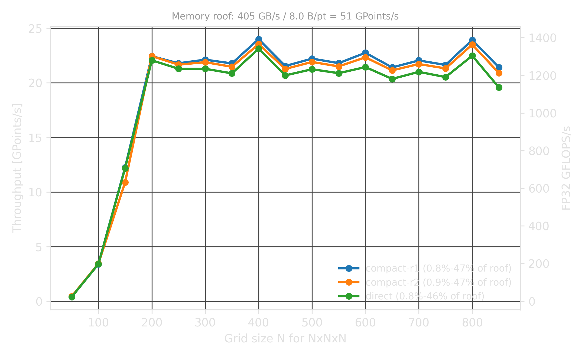
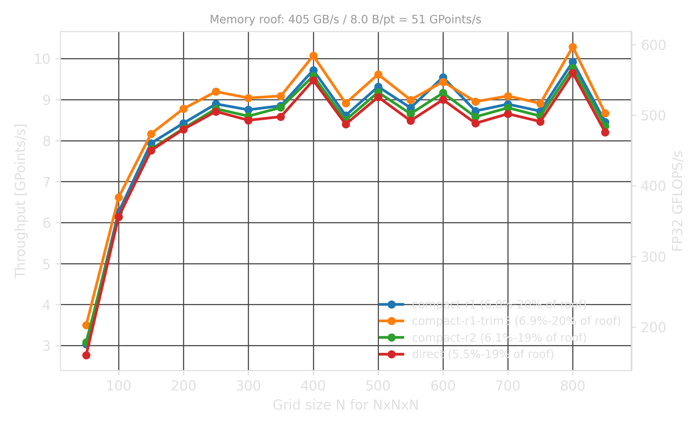
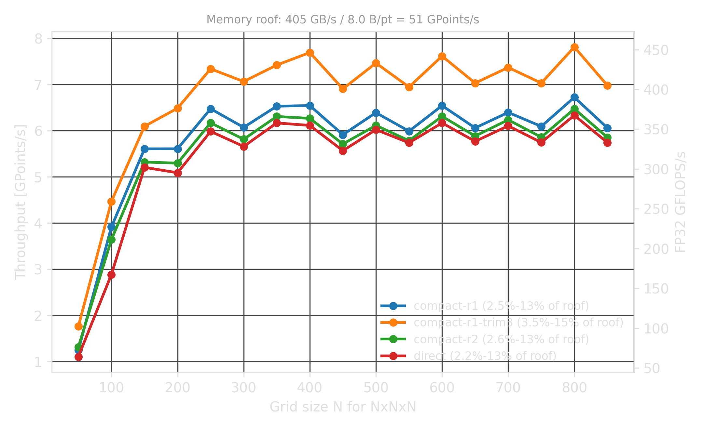

# Stencils as Small Matrix Multiplications

## How to leverage low-precision compute?

LIBXSTREAM stencil sample

---

## Outline

- Seismic stencils and their long spatial legs.
- Mapping stencil operators to small dense GEMMs.
- BF16 and INT8 DPAS preserving FP32 accuracy.
- Compact operators as alternative paths.
- Implementation and performance on Arc B580.

---

## Timeline

| Time      | Topic                                   |
|-----------|-----------------------------------------|
| 0-5 min   | Application: RTM and wave propagation   |
| 5-10 min  | Stencil math and long legs              |
| 10-18 min | Mapping stencils to GEMM/DPAS           |
| 18-24 min | INT8-DPAS Ozaki-1, BF16 vs INT8         |
| 24-30 min | Implementation, performance, discussion |

---

## Why Seismic Stencils?

Reverse Time Migration (RTM) and Full Waveform Inversion (FWI)  
solve wave equations over 3D grids.

$$p_{next} = 2 \cdot p_{now} - p_{prev} + \Delta t^2 \cdot v^2 \cdot \mathcal{L}(p_{now})$$

- $p$: pressure wavefield
- $v$: velocity model
- $\mathcal{L}$: spatial differential operator

The hot loop is repeated stencil evaluation over (many) grid points.

---

## Implemented in the Sample

The current sample is a GPU stencil benchmark and integration example.

| Mode                          | CLI              | Implemented path                             |
|-------------------------------|------------------|----------------------------------------------|
| Isotropic RTM-style Laplacian | `-d 3`           | fused 3-axis BF16-DPAS apply                 |
| TTI-style anisotropic terms   | `-d 9`           | pure terms plus cross-derivative DPAS phases |
| Direct high-order stencil     | `-m 0`           | radius-4 per axis                            |
| Compact variants              | `-m 1`, `-m 2`   | radius-1/radius-2 compact runtime paths      |
| Compact fitting hook          | `-m 3`           | placeholder for fitted compact coefficients  |
| INT8-DPAS Ozaki-1             | `STENCIL_INT8=1` | signed 8-bit slicing with carried exponent   |
| FP32 scalar reference         | `STENCIL_FP32=1` | banded FMA, no DPAS (baseline comparison)    |

---

## Block View

The sample updates one `32 x 32 x 32` output cube per block.

```text
BLK       = 32
RADIUS    = 4          direct 8th-order FD
K_BASE    = BLK + 2*RADIUS = 40
K_PAD     = align16(K_BASE) = 48  (BF16)
K_PAD_I8  = 64                    (INT8, k=32 DPAS alignment)
XMX tile  = 8 x 16
```

For one axis, each block becomes a matrix multiplication.

```text
BF16: D[32 x 48]  * P[48 x 1024]  -> Y[32 x 1024]
INT8: D[32 x 64]  * P[64 x 16]    -> Y[32 x 16]  (per strip)
```

---

## Direct Long-Leg Stencil

An 8th-order second derivative has a radius-4 stencil.

$$u''(i) \approx c_0 \cdot u(i) + \sum_{k=1}^{4} c_k \bigl[u(i-k) + u(i+k)\bigr]$$

Each output point reads nine positions along one axis.  
In 3D isotropic mode this is applied along $x$, $y$, and $z$.

---

## Long Legs as a Matrix

The 1D stencil is a banded operator matrix.

$$D = \begin{bmatrix}
c_4 & c_3 & c_2 & c_1 & c_0 & c_1 & c_2 & c_3 & c_4 & 0 & \cdots \\\\
0 & c_4 & c_3 & c_2 & c_1 & c_0 & c_1 & c_2 & c_3 & c_4 & \cdots \\\\
& & & & \ddots & & & & & &
\end{bmatrix}$$

$$Y = D \cdot P$$

The sample stores $D$ as a dense BF16 surface because DPAS wants regular tiles.  
The zeros are structural convenience.

---

## Three Isotropic GEMMs

The isotropic Laplacian separates into three 1D operators.

$$\mathcal{L}(p) = D_x \cdot p + D_y \cdot p + D_z \cdot p$$

For each axis, the kernel gathers a `K_PAD x XMX_N` panel into SLM
and applies the same DPAS micro-kernel.

```text
for dim in x, y, z:
    gather haloed lines into SLM
    split wavefield into BF16 digits
    accumulate D_dim * P_dim into FP32
```

---

## Low Precision Compute

Use matrix compute units but without giving up accuracy.

<span style="opacity: 0.4; font-size: 50%;">
[ConvStencil 2024] stencil-as-matmul on NVIDIA TC,
[Ichimura+ 2025] INT8 TC elastic wave FE</span>

This work represents FP32 values are as digit sums (Ozaki/Dekker):

$$D \cdot P \approx \sum_i \sum_j D_i \cdot P_j \qquad \text{each } D_i \cdot P_j \text{ is one DPAS call}$$

| Datatype | Digit width | D slices | P slices | Products/dim |
|----------|-------------|----------|----------|--------------|
| BF16     | 8 mantissa  | 2        | 3        | 6            |
| INT8     | 7 signed    | 1        | 1–3      | 1–3          |

Note: BF16 needs 2 D-slices because FD weights span ~11 mantissa bits.
INT8 needs only 1 D-slice because the same weights fit in 7 signed bits
after per-row exponent alignment.

---

## INT8 Ozaki-1

FD operator weights fit in a single 7-bit signed digit (NSLICES_D=1).
Only the wavefield (P-side) needs multi-slice representation.

$$D \cdot P \approx D_0 \sum_j P_j$$

Advantage: half the operator storage, fewer DPAS products.
The number of P slices adapts at runtime to the local exponent range.

```text
nslices_eff = 1  if assumed_exp <= 7
            = 2  if assumed_exp <= 14
            = 3  otherwise
```

---

## Carried-Forward Exponent

INT8 slicing needs a shared exponent per spatial strip.

```text
step N:   read exp_buf[old]  →  slice P  →  DPAS  →  write p_new
          scan p_new exponents  →  write exp_buf[new]

step N+1: read exp_buf[new]  →  ...         (buffers flip)
```

- Margin of +1: covers one-step neighbor growth propagation lag
- Output-based: tracks what was written, not what was read
- Double-buffered: no read/write race between neighbors

---

## DPAS Work Count

BF16 path (default): D-slices $\times$ P-slices $= 2 \times 3 = 6$ DPAS products per axis.  
INT8 path: $1 \times$ P-slices$_{eff}$ = 1–3 DPAS products per axis.

| Operator family   | BF16 work/block | INT8 work/block    |
|-------------------|-----------------|--------------------|
| Isotropic, direct | 3 axes x 6 = 18 | 3 axes x 1-3 = 3-9 |
| TTI pure terms    | 3 axes x 6 = 18 | (BF16 only today)  |
| TTI cross terms   | two DPAS phases | (BF16 only today)  |
| Compact           | smaller radius  | same DPAS, fewer K |

The shape is always small and regular: `8 x 16` DPAS tiles over the K dimension.

---

## Hardware Mapping

The kernel uses Intel GPU matrix and block I/O features.

```text
A-side: 8 rows x K_PAD    operator D (2D block read)
B-side: K_PAD x 16 cols   wavefield (SLM block read)
C:      8 x 16            FP32 accumulator
```

|      | A load         | B load          | DPAS         |
|------|----------------|-----------------|--------------|
| BF16 | 2D 16b 8r16x1c | VNNI from SLM   | bf16 mad k16 |
| INT8 | 2D 8b 8r32x1c  | block_read8 SLM | i8 mad k32   |

---

## TTI: Why It Is Different

Tilted Transverse Isotropy introduces mixed derivatives.

$$\mathcal{L}_\text{TTI}(p) = \text{pure terms} + \text{cross terms}$$

$$\text{cross term: } D_i\bigl(c_{ij} \cdot D_j \cdot p\bigr)$$

Not a wider 1D stencil — a composition of two directional  
derivatives with a pointwise anisotropy field in between.

---

## TTI as Two GEMM Phases

Each cross term is a two-phase DPAS pipeline:

$$T = D_j \cdot P \qquad T = c_{ij} \cdot T \qquad Y \mathrel{+}= D_i \cdot T$$

- `x_slm`: gathered wavefield digits
- `t_slm`: BF16 re-split intermediate after pointwise scaling
- Pure terms reuse the isotropic `stencil_apply` path

---

## Stencil Kinds and GEMM Shapes

| Stencil kind        | Math                            | GEMM form                             |
|---------------------|---------------------------------|---------------------------------------|
| 1D direct FD        | $D_i \cdot P$                   | $32 \times 48$ by $48 \times 1024$    |
| 3D isotropic        | $D_x P + D_y P + D_z P$         | three independent 1D GEMMs            |
| VTI-like pure terms | scaled pure axes                | three GEMMs plus coefficients         |
| TTI cross term      | $D_i(c_{ij} \cdot D_j \cdot P)$ | GEMM, scale, GEMM                     |
| Compact             | repeated compact evolution      | smaller-radius $D_r \cdot P$ per step |

The key design choice is to make the stencil look like many dense,  
small, predictable GEMMs.

---

## Long-Leg Motivation

High-order FD stencils use long spatial legs to reduce dispersion error.

| Benefit                          | Cost on large 3D grids       |
|----------------------------------|------------------------------|
| better wave propagation accuracy | wider block halos            |
| fewer time-step artifacts        | more distant memory accesses |
| familiar RTM/TTI formulation     | more L2/TLB pressure         |

Can time evolution provide the effective reach while each update  
touches only a compact neighborhood?
<span style="opacity: 0.3;">Yes, approximately.</span>

Note: Repeated compact updates compose into a wider domain of dependence.
The hard part is fitting the compact coefficients so the composed symbol
matches the long-leg stencil's dispersion behavior.

---

## Compact Operator Idea

Instead of applying the long-leg radius-4 operator directly,  
use compact operators over time.

<span style="opacity: 0.4; font-size: 50%;">
[Dablain 1986] cascaded Laplacians,
[Liu&Sen 2009] time-space optimized explicit,
[Zhang+ 2016] operator splitting for compact FD</span>

```text
direct:       one radius-4 operator

compact-r1:   radius-1 operator, K=4
compact-r2:   radius-2 operator, K=2
compact-fit:  future fitted compact coefficients
```

Effective reach arises from repeated time updates,  
not from loading the long halo every step.

---

## What Is Implemented Today

| Method     | CLI              | Radius | Status                   |
|------------|------------------|--------|--------------------------|
| Direct     | `-m 0`           | `r=4`  | baseline high-order path |
| Compact r1 | `-m 1`           | `r=1`  | compact isotropic path   |
| Compact r2 | `-m 2`           | `r=2`  | compact isotropic path   |
| Compact fit| `-m 3`           | `r=1`  | placeholder coefficients |
| TTI        | `-d 9`           | direct | cross terms implemented  |
| INT8       | `STENCIL_INT8=1` | `r=4`  | Ozaki-1 with exp_buf     |

INT8 path uses signed 8-bit DPAS (k=32) with runtime slice adaptation.  
Fitted dispersion coefficients are not implemented yet.

---

## Kernel Structure

```text
host:  precompute D (BF16 or INT8+scale), JIT kernel

BF16:  gather → split → DPAS → leapfrog update
INT8:  gather+slice → DPAS → update → scan exp → exp_buf_out
TTI:   GEMM → scale → re-split → GEMM
```

All paths: one dispatch per time step, 3-dim loop inside kernel.

---

## Runtime Controls

```text
./stencil.x -n 800 -d 3 -m 0

-d 3    isotropic pure terms
-d 9    TTI-style pure plus cross terms
-m 0    direct radius-4
-m 1    compact-r1
-m 2    compact-r2
```

Useful environment controls:

```text
STENCIL_INT8=1            enable INT8-DPAS Ozaki-1 path
STENCIL_STRIPS_PER_WG=2   default, best measured grouping
STENCIL_TRIM=N            accuracy/performance tradeoff (BF16)
STENCIL_GRF256=1          tested slower on target system
```

---

## Demo Script

Build on the target system:

```bash
git clone https://github.com/hfp/libxs.git
git clone https://github.com/hfp/libxstream.git
cd libxstream/samples/stencil
echo "Make OpenCL runtime available"
make GNU=1
```

Run the useful comparison (`stencil.py`):

```bash
./stencil.x -m 0 -n 800 -d 3
./stencil.x -m 1 -n 800 -d 3
STENCIL_INT8=1 ./stencil.x -m 0 -n 800 -d 3
STENCIL_TRIM=3 ./stencil.x -m 0 -n 800 -d 3
```

---

## Intel® Arc™ B580 Graphics (FP32)



---

## Intel® Arc™ B580 Graphics (BF16)



Note: `TRIM` drops least-significant digit products, so it is a controlled accuracy tradeoff, not the default.

---

## Intel® Arc™ B580 Graphics (INT8)



Note: `TRIM` drops least-significant digit products, so it is a controlled accuracy tradeoff, not the default.

---

## GPoints/s @ N=800

| Path          | Arc B580 | PVC-1T | PVC-2T\* | H100  |
|---------------|----------|--------|----------|-------|
| FP32 direct   | 22.5     | 40.6   |  81.2    | 100.4 |
| FP32 compact  | 23.9     | 52.3   | 104.6    | 103.5 |
| BF16 direct   | 9.7      | 14.7   |  29.4    | -     |
| BF16 compact  | 9.9      | 15.1   |  30.2    | -     |
| INT8 direct   | 6.3      | 9.7    |  19.4    | -     |
| INT8 compact  | 6.7      | 10.5   |  21.0    | -     |

<div markdown="1" style="opacity: 0.4; font-size: 50%;">

\* Not actually executed but trivially doubled like it is possible with MPI.

**OpenCL device names**
- Intel® Arc™ B580 Graphics
- Intel® Data Center GPU Max 1550 (450W TDP)
- NVIDIA H100 80GB HBM3

</div>


Note: B580 is bandwidth-bound — FP32 banded-FMA wins because it avoids
the digit-slicing gather overhead. PVC has more compute headroom where
compact paths and INT8 benefit. Both DPAS paths preserve FP32 accuracy.

---

## Takeaway

Seismic stencils as dense small matrix multiplications.

- BF16-DPAS (Dekker splitting, 2×3 digits) and INT8-DPAS (Ozaki-1, 1×1–3 digits)
- FP32 banded-FMA fastest on bandwidth-bound B580
- INT8 competitive on compute-rich PVC (fewer DPAS products)
- Compact paths: long-leg reach, short-leg cost
- RTM isotropic: three directional GEMMs per time step

The hook: expressing stencil structure so matrix engines can execute it.

---

## LIBXSTREAM

Minimal compiler requirements (C90), e.g., GNU\* Compiler.

- API to ease buffer management and carrying kernel code
- Based on LIBXS, can make use of powerful primitives
  - For example, predicting tuning parameters

Leverage runtime code generation to specialize kernels (JIT).

---

## OpenCL

OpenCL is interoperable with respective vendor model, e.g., SYCL.

- Intel: Driver and SYCL already deliver OpenCL, otherwise
  - Install opencl-c-headers, ocl-icd-libopencl1, ocl-icd-opencl-dev
  - Install https://github.com/intel/compute-runtime
- Nvidia: Driver and CUDA already deliver OpenCL
